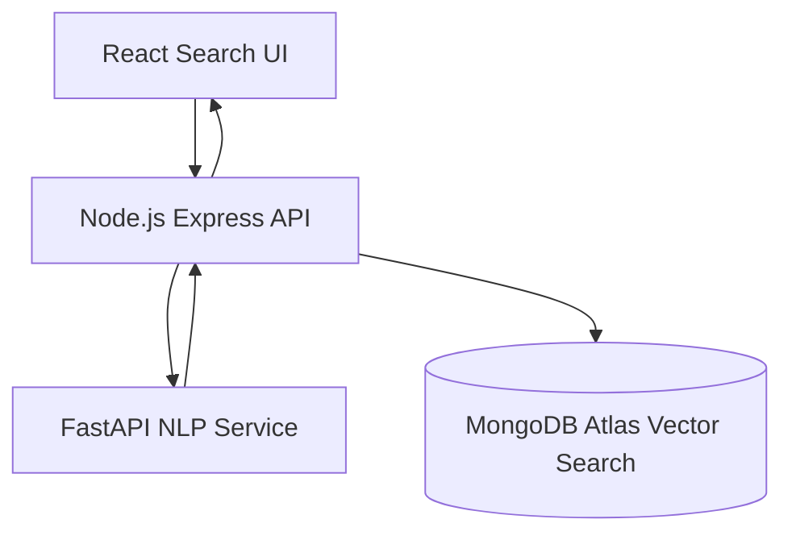

# MongoDB Semantic Search Engine


Production-style semantic search platform built with **React, Node.js, FastAPI, and MongoDB Atlas Vector Search**.

## Project Overview

This repository implements a microservices semantic search system where documents are embedded using `all-MiniLM-L6-v2`, stored in MongoDB, and queried by vector similarity from a React UI.

## Problem Statement

Traditional keyword-based search engines often fail to retrieve relevant results when queries use different wording than the stored documents.

Example:

Query:
How to improve database performance?

Document:
Techniques to optimize MongoDB queries

Keyword search fails because the words differ.

Semantic search solves this problem by converting text into **vector embeddings** and retrieving documents using **similarity search**.

## Architecture Diagram



Detailed architecture and data flows: `docs/architecture.md`

## How Semantic Search Works

1. Documents are converted into vector embeddings using Sentence Transformers.
2. Embeddings are stored inside MongoDB Atlas.
3. A vector index is created using MongoDB Atlas Vector Search.
4. When a user submits a query:
  - The query is converted to an embedding.
  - MongoDB performs vector similarity search.
  - The most relevant documents are returned.

## Features

- Document ingestion pipeline with batch embedding generation
- Sentence Transformers embeddings (`all-MiniLM-L6-v2`)
- MongoDB Atlas Vector Search (`$vectorSearch`)
- Semantic search API with validation, filtering, and pagination
- Modern React + Tailwind search interface
- Dockerized services and GitHub Actions CI/CD workflow
- Jest/Supertest and pytest test coverage examples

## Technology Stack

- Frontend: React, Vite, TailwindCSS, React Query
- Backend API: Node.js, Express, MongoDB Driver, Zod
- AI Service: Python, FastAPI, sentence-transformers
- Database: MongoDB Atlas Vector Search
- DevOps: Docker, Docker Compose, GitHub Actions

## Repository Structure

```text
mongodb-semantic-search-engine/
├── frontend/
├── backend/
├── ai-service/
├── docs/
├── database/
├── deployment/
├── .github/workflows/
├── docker-compose.yml
├── .env.example
└── README.md
```

## Clone the Repository

First clone the project from GitHub:

```bash
git clone https://github.com/<your-username>/mongodb-semantic-search-engine.git
cd mongodb-semantic-search-engine
```

This will download the entire project to your local machine.

## Installation Guide

### 1. Prerequisites

- Node.js 20+
- Python 3.11+
- Docker + Docker Compose (optional)
- MongoDB Atlas cluster with Vector Search enabled

Ensure a vector index named `vector_index` exists on the `embedding` field with:

- dimensions: 384
- similarity: cosine

### 2. Configure Environment

Copy the environment template:

```bash
cp .env.example .env
```

Then open `.env` and update the MongoDB connection string.

Example:

```bash
MONGO_URI=mongodb+srv://<username>:<password>@cluster.mongodb.net/?retryWrites=true&w=majority
```

Replace:

- `<username>` with your MongoDB Atlas username
- `<password>` with your MongoDB Atlas password
- `cluster.mongodb.net` with your cluster URL

Other variables:

```bash
MONGO_DB=semantic_search
MONGO_COLLECTION=documents
VECTOR_INDEX_NAME=vector_index
```

### 3. Install Dependencies

```bash
cd backend && npm ci
cd ../frontend && npm ci
cd ../ai-service && pip install -r requirements.txt
```

## Running Locally (Without Docker)

Terminal 1:

```bash
cd ai-service
uvicorn app.main:app --reload --port 8000
```

Terminal 2:

```bash
cd backend
npm run dev
```

Terminal 3:

```bash
cd frontend
npm run dev
```

### Ingest Sample Documents

```bash
cd backend
npm run ingest
```

Or provide your own file:

```bash
npm run ingest -- ./path/to/documents.json
```

## Example Queries

Try these queries in the search interface:

- How to optimize MongoDB queries?
- How to scale Node.js APIs?
- How to improve backend performance?
- What is semantic search?

The system retrieves documents based on semantic similarity rather than keyword matching.

## Docker Deployment

Build and start all services:

```bash
docker compose up --build
```

Services:

- Frontend: `http://localhost:5173`
- Backend: `http://localhost:5000`
- AI Service: `http://localhost:8000`

Note: Atlas is used externally for vector search. Set Atlas URI in `.env`.

## API Documentation

### Backend

- `GET /health` - backend health
- `POST /api/search` - semantic search

Request body:

```json
{
  "query": "How to improve database performance?",
  "limit": 10,
  "page": 1,
  "filter": {
    "tags": ["mongodb"],
    "author": "DB Team"
  }
}
```

### AI Service

- `GET /health`
- `POST /embed`
- `POST /embed/batch`

Example `/embed` request:

```json
{
  "text": "Optimize query latency in MongoDB"
}
```

## Database Design

See `database/schema.md` for schema, index definition, and aggregation pipeline.

## Testing

Backend:

```bash
cd backend
npm test
```

AI service:

```bash
cd ai-service
pytest -q
```

Testing strategy details: `docs/testing.md`

## CI/CD Pipeline

Workflow file: `.github/workflows/ci-cd.yml`

Pipeline stages:

1. Install dependencies
2. Run backend + AI tests
3. Build frontend
4. Build Docker images
5. Push/deploy placeholders for your target cloud

## Performance Optimization

Optimization guide: `docs/performance.md`

Includes:

- Redis caching strategy
- Vector query tuning
- Hybrid search patterns
- Index tuning
- Monitoring recommendations

## Screenshots

Add screenshots here after running the UI:

- `docs/screenshots/search-home.png`
- `docs/screenshots/search-results.png`
- `docs/screenshots/error-state.png`

## License

This project is licensed under the MIT License.

See the `LICENSE` file for details.

## Author

Developed as a demonstration project for **AI-powered semantic search using MongoDB Vector Search**.
