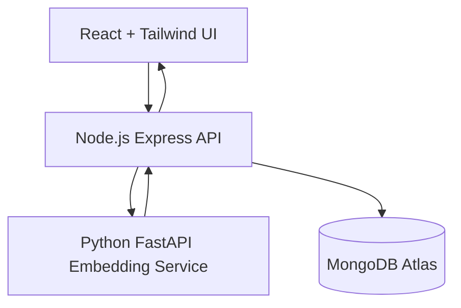

# System Architecture

## High-level Diagram

## Components

- `frontend`: Search interface, loading/error states, ranked results rendering.
- `backend`: API gateway for query validation, embedding request, vector search execution.
- `ai-service`: Embedding generation service using `all-MiniLM-L6-v2`.
- `mongodb atlas`: Persistent document + vector storage with Atlas Vector Search.

## Ingestion Data Flow

1. Ingestion script reads JSON documents in batches.
2. Script sends batch text to `/embed/batch` on FastAPI service.
3. Service returns 384-dimension embeddings.
4. Backend script writes document + metadata + embedding to MongoDB.
5. Atlas index makes vectors searchable.

## Search Data Flow

1. User enters natural language query in React UI.
2. UI sends query to Node API `/api/search`.
3. API validates payload and requests query embedding from FastAPI `/embed`.
4. API executes `$vectorSearch` against Atlas.
5. Ranked results with similarity score return to UI.

## Technology Justification

- React + Vite: fast DX and low-latency UI iteration.
- Express: simple API orchestrator for microservice calls.
- FastAPI: Python AI ecosystem + high-performance inference endpoint.
- Sentence Transformers: proven compact model quality for semantic search.
- MongoDB Atlas Vector Search: managed operational and vector DB in one place.

## Scalability Strategy

- Horizontal scale frontend/backend/AI service containers independently.
- Add Redis cache for repeated query embeddings and result sets.
- Use queue-driven ingestion for very large datasets.
- Separate read and write workloads by service role.

## Security Considerations

- Keep secrets in environment variables and CI secrets manager.
- Enforce request size limits and input validation.
- Add API rate limiting and authentication in production.
- Restrict CORS origin and use HTTPS termination at ingress.
